# TryHackMe: Sequence — Write-up

> **Room:** [Sequence](https://tryhackme.com/room/sequence)  
> **Target hostname:** `review.thm`  
> **Scope:** TryHackMe lab environment  
> **Objective:** Chain the discovered web vulnerabilities to retrieve all three flags.

This write-up documents my route through the room, including the ideas I tested, the steps that worked, and what I learned while researching. Screenshots are included beside the relevant steps.

---

## 1. Initial Setup

I first added the target machine's IP address to `/etc/hosts` and mapped it to `review.thm`. This allowed me to access the application using its hostname throughout the room.

```bash
sudo nano /etc/hosts
```

Add the following entry, replacing `<TARGET_IP>` with the IP address assigned to your machine:

```text
<TARGET_IP> review.thm
```

I then opened the site using `http://review.thm`.

## 2. Port and Web Enumeration

I started with an Nmap scan to identify the exposed services.

```bash
nmap -sC -sV -oN nmap_scan.txt review.thm
```

The scan identified two open ports:

| Port | Service | Observation |
|---|---|---|
| `22/tcp` | SSH | OpenSSH on Ubuntu |
| `80/tcp` | HTTP | Apache web server |

One important finding was that the `PHPSESSID` cookie did **not** have the `HttpOnly` flag set.

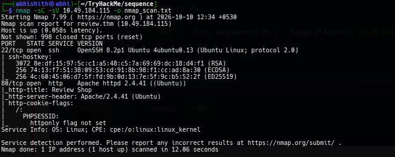

I also ran directory enumeration with Gobuster. One particularly useful discovery was `/mail/dump.txt`.

### Finding the Leaked Email

The file `/mail/dump.txt` contained an email describing the internal Finance and Lottery features. It also disclosed the password required to access the Finance feature. The password recorded in public walkthroughs is `S60**f5j`; check it against the value shown in your own active room instance.

The important details were:

- The Finance feature was hosted on an internal network.
- The Lottery feature was on the same internal segment.
- The email included a password for the protected Finance panel.

I saved these details for later because the features were not directly available from the normal public-facing pages.

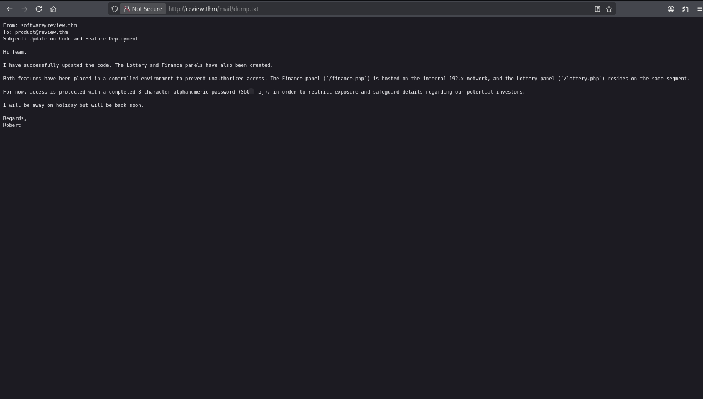

### Website review

The website had a login page and a Contact Us page. I checked the pages and their source, but did not notice an obvious issue at that point. I tried common credentials on the login page, but they did not work, so I continued investigating the contact form.

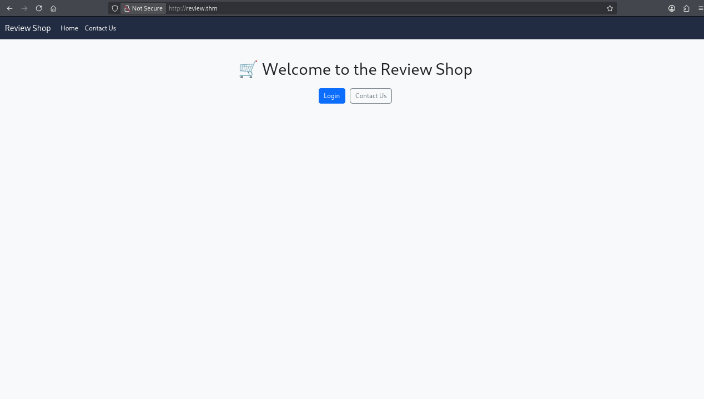

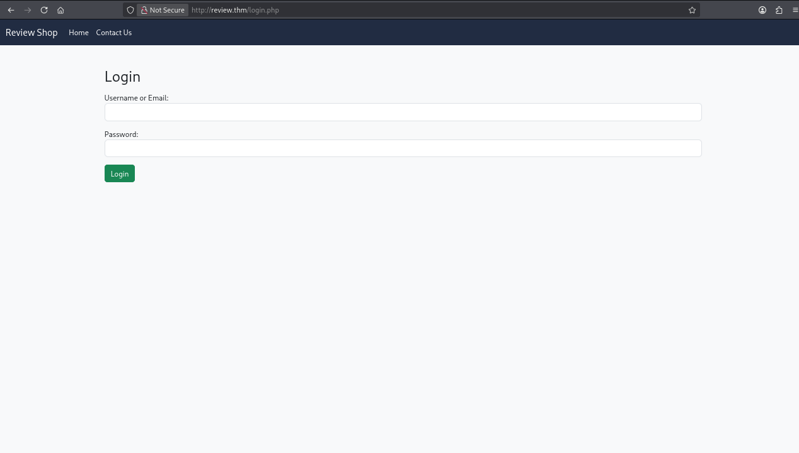

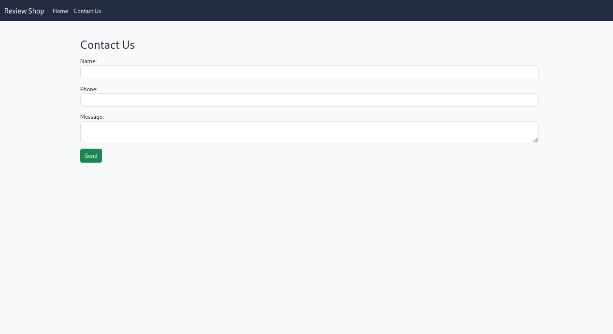

## 3. Stored XSS and Moderator Session

I submitted a normal message through the Contact Us form. After submission, the page indicated that someone would review the message.

At this point, I connected two observations:

1. The application appeared to have a process where a moderator reviewed submitted messages.
2. Nmap had reported that the session cookie lacked the `HttpOnly` attribute.

This led me to test for **stored cross-site scripting (XSS)** and determine whether JavaScript running in the reviewer's browser could read the session cookie.

I submitted a cookie-exfiltration payload that sent `document.cookie` to my listener. When the submitted message was reviewed, I received the moderator's session cookie. I then replaced my own `PHPSESSID` value with the captured value and refreshed the application.

> **Important distinction:** `HttpOnly` being absent does not create XSS by itself. It means JavaScript can read the cookie if script execution is possible in the page. The stored XSS was the mechanism that made the cookie theft possible.

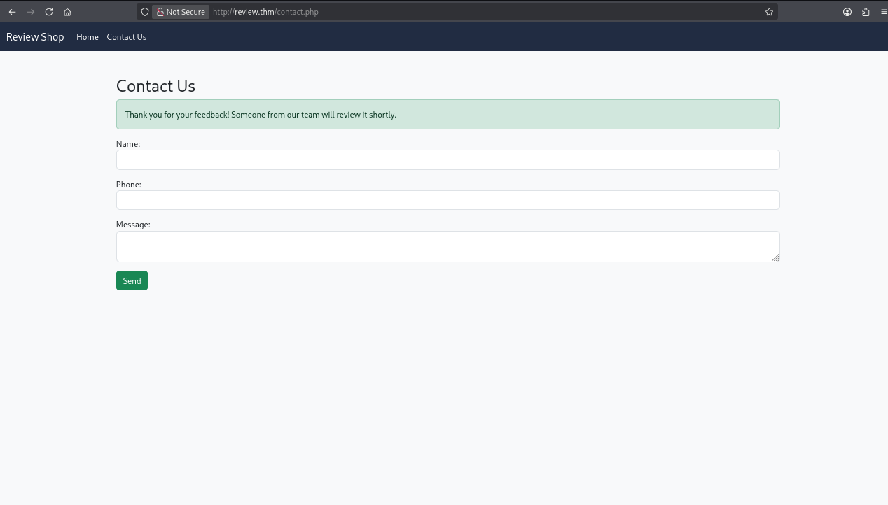

The callback reached my listener, confirming that the browser had sent the cookie data. I used the captured session value in my browser.

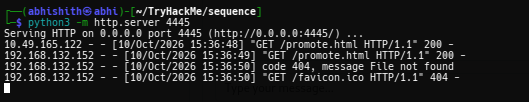

After replacing my session cookie, I reached the moderator dashboard and retrieved the **first flag**.

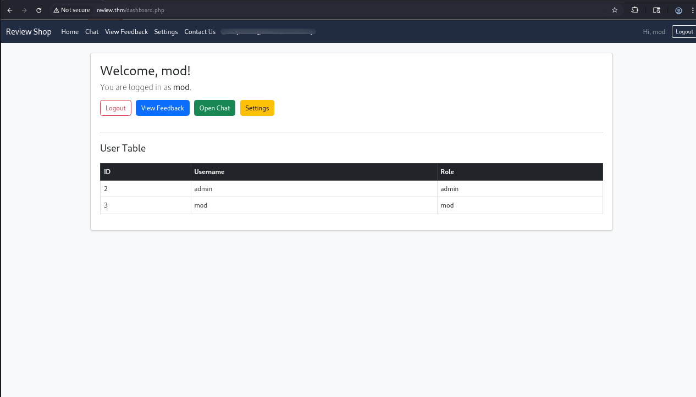

The dashboard exposed additional functionality, including Settings and Chat. I opened Settings and changed the moderator account's password so I could log in normally again if needed.

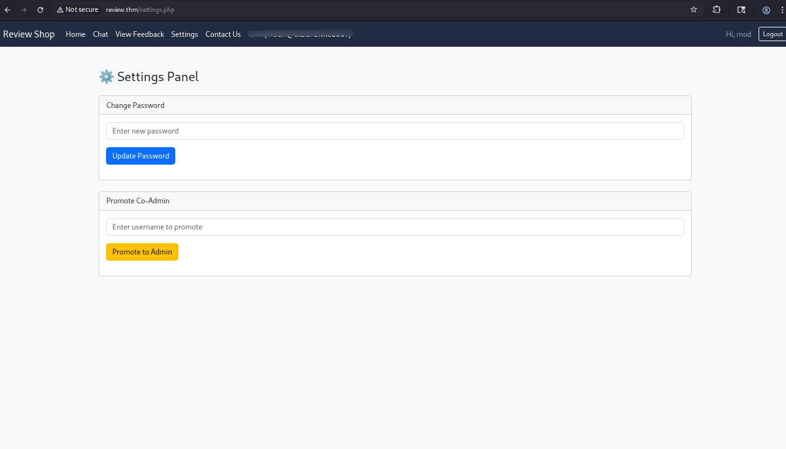

## 4. Understanding the Promotion Token

The Settings page included a feature for promoting a user to co-admin. The promotion action was restricted to an administrator in the interface, so I examined how the request worked.

I captured the promotion request and found that it used a **GET request** with two parameters:

- `username`
- `csrf_token_promote`

The token for the `mod` username was:

```text
ad148a3ca8bd0ef3b48c52454c493ec5
```

I investigated the token and found that it matched the MD5 hash of the username `mod`. This was a useful discovery: the value was not encrypted or something that could be decoded. It was a predictable hash that could be reproduced for another username.

For example, the MD5 hash of `admin` is:

```text
21232f297a57a5a743894a0e4a801fc3
```

I used a hash generator / hash-checking tools on Windows to verify the value. The key issue was that the token was predictable because it was derived from a known username, rather than being a random, session-bound CSRF token.

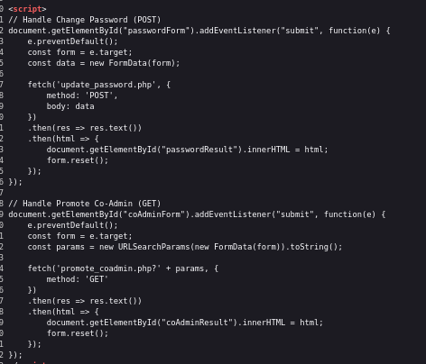

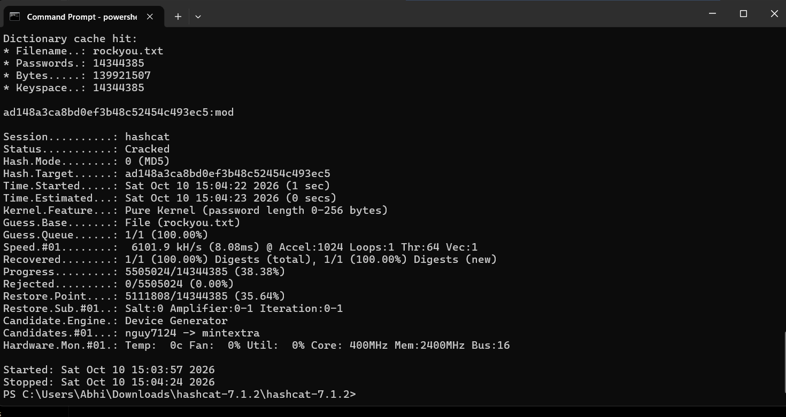

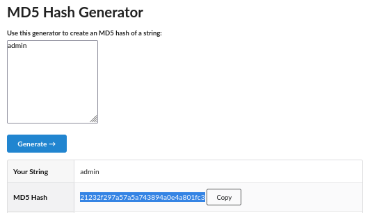

## 5. Promoting the Moderator to Admin

I next explored the Chat feature. A straightforward XSS payload was blocked by the application, so I tried a different approach: sending a link that the administrator would open.

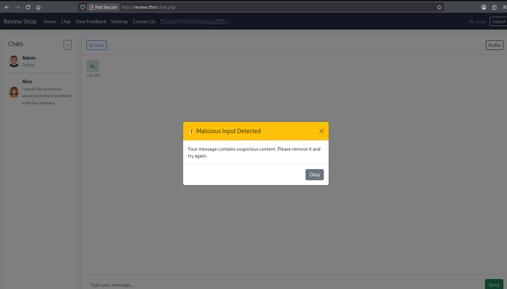

The idea was to make the administrator's authenticated browser visit the state-changing promotion endpoint. I prepared an HTML page that automatically redirected to the promotion URL using the predictable token for `admin`:

```html
<!DOCTYPE html>
<html>
<head>
    <meta http-equiv="refresh"
          content="0;url=http://review.thm/promote_coadmin.php?username=mod&csrf_token_promote=21232f297a57a5a743894a0e4a801fc3">
    <title>Promotion</title>
</head>
<body>
    <p>Redirecting...</p>
</body>
</html>
```

The same payload is included in [`promote.html`](promote.html). I hosted the page and sent its link through Chat. When the administrator opened the link, their browser followed the redirect to the promotion endpoint while authenticated to `review.thm`.

The request promoted `mod` to admin. I then returned to the dashboard and confirmed that the role change had taken effect. This gave me access to the **second flag**.

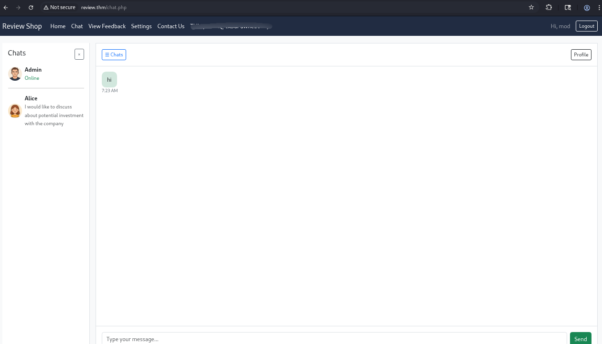

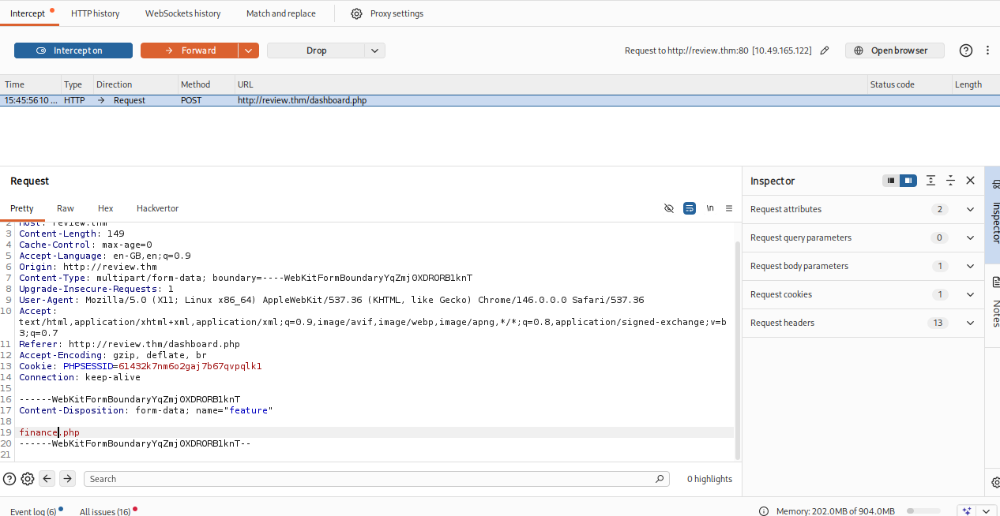

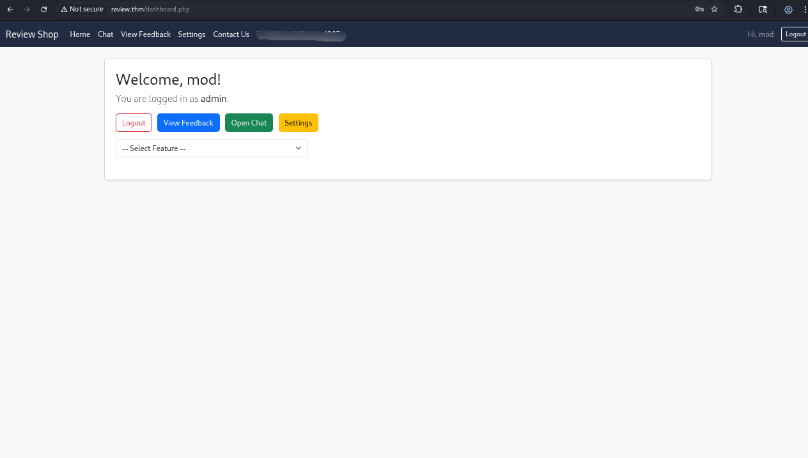

> **Why this worked:** The promotion endpoint changed account privileges through a GET request, and the CSRF token was predictable. A request that changes state should not be implemented as a simple GET action, and a CSRF token should be unpredictable and bound to the user's session.

## 6. Accessing the Finance Feature

After obtaining admin access, I explored the dashboard and noticed the Lottery feature. The email found earlier mentioned a separate Finance feature, so I intercepted the request generated when selecting Lottery.

The request included a `feature` parameter. I changed its value from:

```text
lottery.php
```

to:

```text
finance.php
```

This caused the application to load the Finance feature instead of Lottery. The panel requested the password disclosed in `/mail/dump.txt`; after entering it, I gained access to the Finance page and its file-upload functionality.

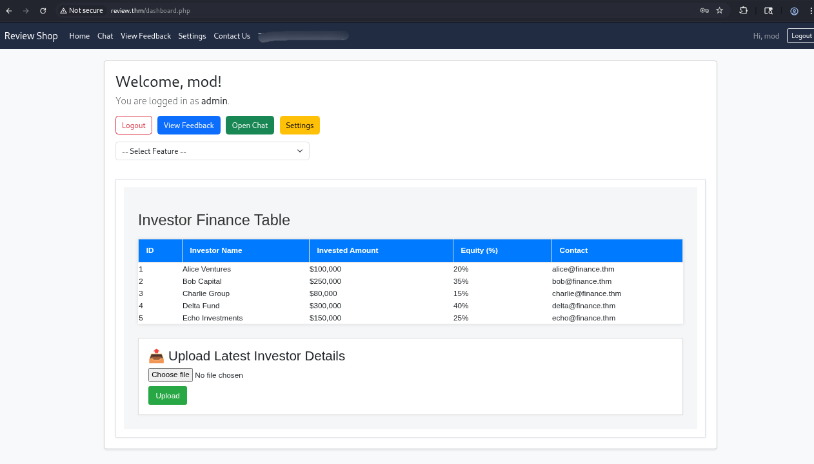

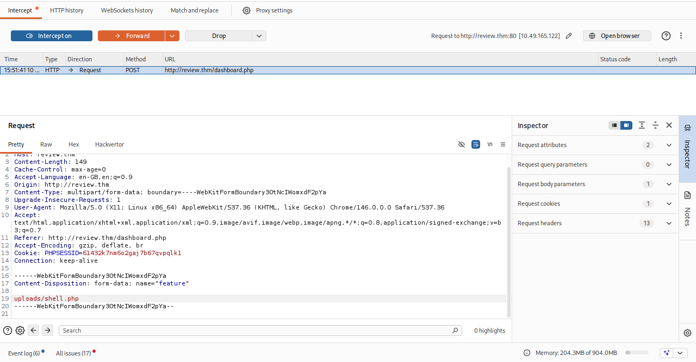

## 7. File Upload and Reverse Shell

I uploaded a normal file first and observed where the application stored uploaded files. Knowing the upload location helped me plan the next step.

I then prepared a PHP reverse shell, configured its callback IP address and port for my attack machine, and uploaded it through the Finance panel. I started a listener on the matching port and triggered the uploaded PHP file through the application's feature/request flow.

The connection succeeded and gave me a shell as `root` **inside the Docker container**.

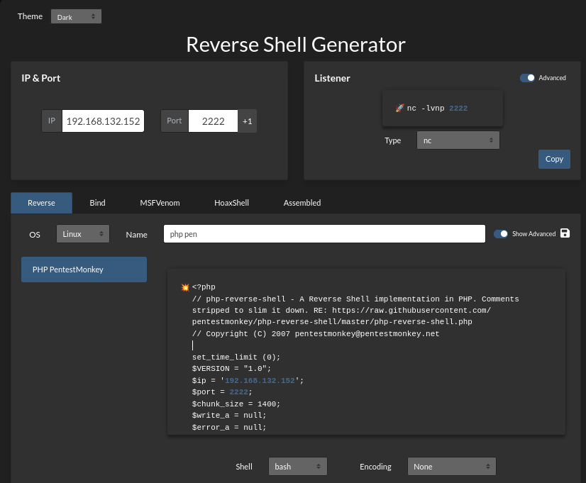

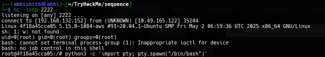

At first, I expected to find the final flag from this shell, but I could not locate it. After further research, I learned that the shell was running inside a Docker container. The third flag was on the host filesystem, outside the container's own root filesystem.

This was the point where I needed to understand the container environment rather than continue searching only inside the current container.

## 8. Understanding the Docker Escape

I had to research this stage because I was not familiar with the Docker escape technique when I first reached it. The key was that the environment allowed Docker commands to be run from inside the compromised container, and the Docker image used by the room was available locally.

### 8.1 Upgrade the shell to an interactive TTY

The reverse shell was not a fully interactive terminal. I used the following commands to improve terminal interaction:

```bash
python3 -c 'import pty; pty.spawn("/bin/bash")'
```

Then I suspended the shell with `Ctrl+Z` and ran this command in my local terminal:

```bash
stty raw -echo && fg
```

After returning to the shell, I pressed `Enter` if needed.

### 8.2 Start a container with the host filesystem mounted

The commands I used are also preserved in [`cmds.txt`](cmds.txt):

```bash
docker run -it --rm -v /:/host phpvulnerable:latest /bin/sh
```

**What this command does:**

| Part | Meaning |
|---|---|
| `docker run` | Creates and starts a new container |
| `-it` | Runs it interactively with a terminal |
| `--rm` | Removes the new container when it exits |
| `-v /:/host` | Mounts the host's `/` filesystem at `/host` inside the new container |
| `phpvulnerable:latest` | Uses the locally available image |
| `/bin/sh` | Opens a shell inside the new container |

The critical part is `-v /:/host`. It exposes the host's entire filesystem inside the new container at `/host`. If an attacker can control the Docker daemon from a compromised container, they may be able to create a container with sensitive host paths mounted into it. This can lead to host compromise.

Once the new shell opened, I checked the host's root directory through the mount and read the flag:

```bash
cat /host/root/flag.txt
```

This revealed the **third flag**, completing the room.

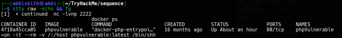

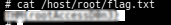

> **Technical note:** The root cause is not necessarily a bug in a particular Docker version. Exposing Docker daemon access or its socket to a compromised container is a dangerous configuration because that access can allow container creation and host filesystem mounts. Other public walkthroughs use Docker API requests or a different image, but the underlying weakness is similar.

## 9. Tools Used

| Tool | Purpose |
|---|---|
| **Nmap** | Port and service enumeration |
| **Gobuster** | Directory and file discovery |
| **Browser Developer Tools** | Reviewing pages, cookies, and application behavior |
| **Burp Suite** | Intercepting and modifying HTTP requests |
| **Python HTTP server / listener** | Receiving the cookie callback and supporting payload delivery |
| **MD5 hash generator / Hashcat** | Checking the predictable username-derived token |
| **PHP reverse shell** | Obtaining a shell through the upload feature |
| **Docker CLI** | Starting a container with the host filesystem mounted |

## 10. What I Learned and Technical Notes

- A state-changing GET endpoint combined with weak CSRF protection can allow an administrator's browser to perform an action simply by following a link.
- The `feature` parameter was important because changing it exposed a feature that was not available through the normal dashboard flow.
- A successful root shell inside a container does not automatically mean the host has been compromised. I needed to identify the container boundary and investigate how Docker was exposed.
- Access to the Docker daemon is highly privileged. Mounting the host root filesystem into a container can expose host files and lead to host-level compromise.
- When I got stuck at the Docker stage, researching the technique helped me understand why the command worked instead of treating it as a command to memorize.

### Final takeaway

Sequence was a good example of vulnerability chaining. The initial findings were not enough on their own; the path depended on connecting information disclosure, stored XSS, session hijacking, weak CSRF protection, feature selection tampering, file upload, and unsafe Docker access.

I completed the room by following the chain step by step, including researching the Docker stage after my first shell did not reveal the final flag.

---

**Disclaimer:** This write-up documents testing performed in the TryHackMe lab environment. Use these techniques only in systems you own or are explicitly authorized to assess.
